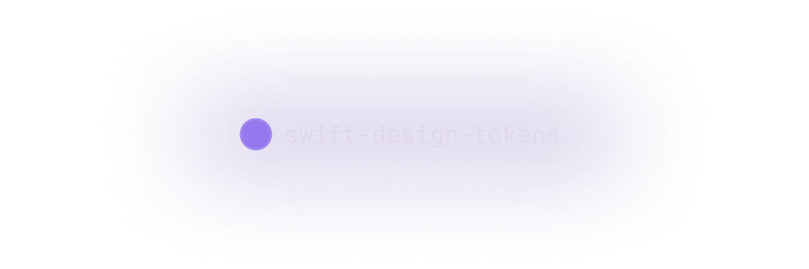

<picture>
  <source srcset="images/header/dark.png" media="(prefers-color-scheme: dark)"/>
  <source srcset="images/header/light.png"  media="(prefers-color-scheme: light)"/>
  
</picture>

[](https://codemagic.io/app/670fb761a6132888f126d3dd/test/latest_build)

## What's `design-tokens`?

`design-tokens` is a command line tool to translate design tokens into Swift source code.
This package follows the [Design Tokens Format](https://tr.designtokens.org/format) specifications by the [Design Tokens Community Group](https://www.w3.org/groups/cg/design-tokens/) for the translation.

## Install

### Compile sources

To compile the binary, run the following command in the directory of the cloned repository:

```bash
swift build -c release design-tokens --show-bin-path
```

The command will output the path of the built binary.

Alternatively, you can run the tool directly without exporting a binary.

```bash
swift run -c release design-tokens
```

## Configuration

The tool must be configured via a [configuration manifest](Documentation/Configuration.md) JSON file to run, and generate an output. 

## Usage

The command line tool provides two commands to initialize a configuration manifest, and to generate output for the specified design token files.

### `init`
Scaffolds a configuration manifest file with default parameters. To scaffold a configuration, the path to the input design token file is required.

```bash
design-tokens init -i design-tokens.json
```

### `generate`
Generates the output as configured in the configuration manifest.

```bash
design-tokens generate
```

## Output

The command line tool generates source code as the resulting output of the design tokens translation. The [format of the output](Documentation/Output.md) can be customized on a per-token basis.

#### Example

```json
{
  "input": "design-tokens.json",
  "colors": {
    "formats": [
      "SwiftUI",
      "UIKit"
    ],
    "output": "Output/Colors/"
  },
  "dimensions": {
    "output": "Output/Dimensions/"
  }
}
```

Using the manifest above, the `generate` command will generate `SwiftUI`, and `UIKit` source code for the color tokens in the `Output/Colors/` directory. It will also generate source code (default) for the `dimension` tokens in the `Output/Dimensions/` directory.
